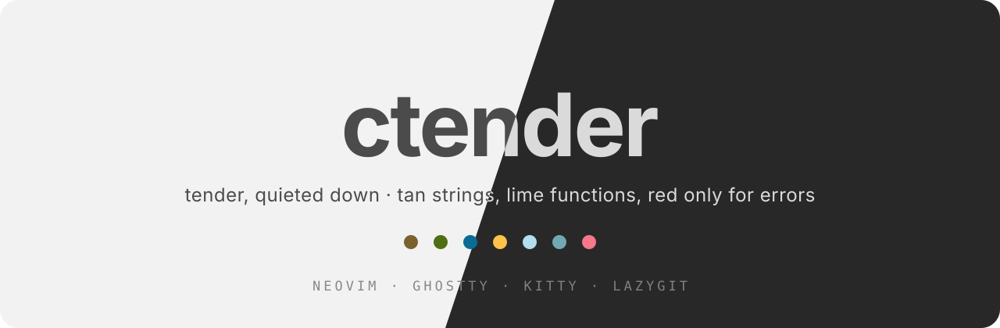
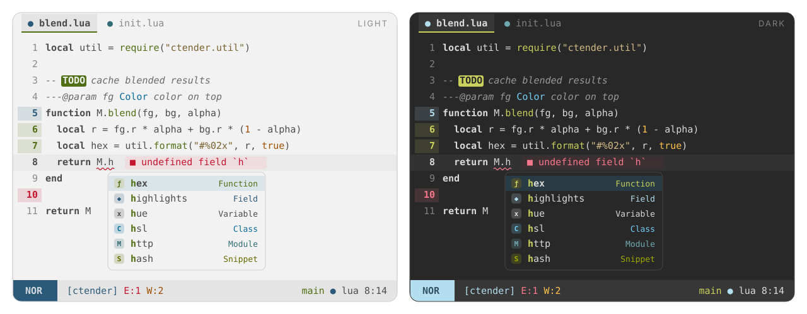

<p align="center">
  
</p>

<p align="center">
  <b>tender, quieted down.</b><br>
  A quiet take on the tender palette, now with a light variant: four hues for code, and red only for errors and deletions.
</p>

<p align="center">
  
  
  
</p>

---

<p align="center">
  
</p>

## Philosophy

[tender](https://github.com/jacoborus/tender.vim) is a lovely palette: a
neutral grey background, tan strings, lime functions, sky-blue types and amber
constants. But it is dark only, it paints operators red, and it knows nothing
about the plugins, terminals and tools around a modern Neovim. **ctender**
keeps tender's colors, adds a light variant, and cuts the syntax down to what
earns a color:

- **Code is mostly one color.** Keywords, variables, properties, modules and
  operators all use the same foreground. Only four things get a hue, the same
  ones tender gives them under treesitter, and the same colors their LSP kinds
  use in the completion menu:
  | Token | Color |
  | --- | --- |
  | strings | **tan** (`yellow`) |
  | functions and methods | **lime** (`green`) |
  | types, classes, constructors | **sky** (`cyan`) |
  | constants, numbers, booleans, `null` | **amber** (`orange`) |

  Everything else is told apart by shape. Keywords are bold; comments are
  italic and a step dimmer than the code (still WCAG AA), and you can change
  both. Set `mono = true` for pure monochrome.
- **Red means error.** It appears on diagnostics, error messages,
  `FIXME`/`BUG` markers, git deletions and the Replace mode block of the
  statusline, and nowhere in code. A test checks this.
- **No purple, no pink.** tender has none, and neither does ctender. Where a
  tool needs a "magenta" (ANSI color 5, mini.icons purple icons) it gets
  tender's calm teal (`azure`).
- **Color where it means something:**
  | Where | Colors |
  | --- | --- |
  | Git (gitsigns, diff, lazygit) | add **lime** · change **pale blue** · delete **red** |
  | Diagnostics | error red · warn amber · info sky · hint teal · ok lime |
  | LSP completion kinds (blink.cmp, dropbar) | one color per kind, the same everywhere and the same as in the code |
  | File icons (mini.icons) | icon colors, with red folded into amber and purple into teal |
  | Search, `TODO` / `FIXME` / `NOTE` markers | attention colors (lime is tender's UI accent) |
  | Statusline modes (`StMode*`) | as in tender's airline theme: normal **pale blue** · insert **lime** · visual **amber** · replace **red** · command **teal** · other **sky** |
- **Easy on the eyes.** The dark variant is tender's own neutral grey
  (`#282828`) with its pearl text (`#dadada`, a notch softer than `#eeeeee`).
  The light variant is a neutral paper (`#f2f2f2`) with soft graphite
  (`#4b4b4b`); each accent keeps its tender hue and is darkened just enough to
  read on it. Every accent passes **WCAG AA (≥ 4.5:1)** on both the background
  and the statusline/tab color, and so does every group that puts text on its
  own fill: selection, search, markers, statusline modes (`scripts/contrast.lua`).
- **The whole tender palette.** All 27 colors, from the accents to `blue5`,
  `green4`, `red3`, `gandalf` and `darkest`, each with a job (see
  [Palette](#palette)).

## Features

- Two variants, `light` and `dark`, plus `ctender`, which follows
  `'background'`. Neovim 0.10+ detects the terminal background (OSC 11), so the
  theme matches your terminal automatically.
- **Extreme performance.** Highlights are compiled to stripped LuaJIT
  bytecode with integer colors. A cached load is a single `loadfile()` and runs in
  **about 4 ms**, roughly 2× faster than the built-in `habamax`. The cache is
  keyed by a hash of your config, so it never goes stale.
- Built for **Neovim 0.12**. It covers every group the default colorscheme defines,
  plus `OkMsg`, `StderrMsg`, `StdoutMsg`, `DiffTextAdd`, `PmenuMatch`, `PmenuBorder`,
  `PmenuShadow`, `ComplMatchIns`, `SnippetTabstop*`, `DiagnosticVirtualLines*`,
  `LspReferenceTarget`, treesitter captures and LSP semantic tokens.
- **Matching themes for other tools**, generated from the same palette:
  Ghostty, Kitty and Lazygit.

## Supported plugins

| Plugin | Notes |
| --- | --- |
| [blink.cmp](https://github.com/saghen/blink.cmp) | menu, docs, signature, ghost text, **colored kinds** (also `CmpItemKind*`) |
| [mini.icons](https://github.com/echasnovski/mini.icons) | real icon colors |
| [mini.pick](https://github.com/echasnovski/mini.pick) / [mini.extra](https://github.com/echasnovski/mini.extra) | |
| [mini.files](https://github.com/echasnovski/mini.files) | |
| [mini.tabline](https://github.com/echasnovski/mini.tabline) | lime underline on the current buffer, modified buffers in the git "change" blue |
| [gitsigns.nvim](https://github.com/lewis6991/gitsigns.nvim) | signs, `numhl`, `linehl`, inline, preview, staged, blame |
| [dropbar.nvim](https://github.com/Bekaboo/dropbar.nvim) | kind icons colored like the completion menu |
| [grug-far.nvim](https://github.com/MagicDuck/grug-far.nvim) | |
| [mason.nvim](https://github.com/mason-org/mason.nvim) | |
| [lazy.nvim](https://github.com/folke/lazy.nvim) | |
| [nvim-treesitter](https://github.com/nvim-treesitter/nvim-treesitter) | captures incl. `@markup.*`, `@diff.*`, `@comment.todo` … |

## Installation

[lazy.nvim](https://github.com/folke/lazy.nvim):

```lua
{
  "amonteirom96/ctender.nvim",
  lazy = false,
  priority = 1000,
  opts = {},
  config = function(_, opts)
    require("ctender").setup(opts)
    vim.cmd.colorscheme("ctender")
  end,
}
```

No `build` step is needed: the cache is keyed by the plugin version and your
config, so an update recompiles on its own.

Native `vim.pack` (Neovim 0.12):

```lua
vim.pack.add({ "https://github.com/amonteirom96/ctender.nvim" })
require("ctender").setup({})
vim.cmd.colorscheme("ctender")
```

### Colorschemes

| Command | Behavior |
| --- | --- |
| `:colorscheme ctender` | follows `'background'` (or the `variant` option) |
| `:colorscheme ctender-light` | always light |
| `:colorscheme ctender-dark` | always dark |

## Configuration

Calling `setup()` is optional. These are the defaults:

```lua
require("ctender").setup({
  variant = "auto",          -- "auto" (follow 'background') | "light" | "dark"
  transparent = false,       -- no background on Normal, floats and the sign column
  terminal_colors = true,    -- set g:terminal_color_0..15
  dim_inactive = false,      -- slightly different background on unfocused windows
  muted_comments = false,    -- comments even fainter, in the muted UI tone
  mono = false,              -- all code in the foreground color (pure monochrome)
  float = {
    solid = false,           -- filled floats with an invisible border
  },
  styles = {                 -- any nvim_set_hl attributes (bold, italic, underline…)
    comments = { italic = true },
    keywords = { bold = true },
    functions = {},
    variables = {},
    strings = {},
    types = {},
    constants = {},
    operators = {},
  },
  integrations = {           -- set to false to skip a plugin's groups
    blink = true,
    dropbar = true,
    gitsigns = true,
    grug_far = true,
    lazy = true,
    mason = true,
    mini = true,             -- icons, pick, extra, files, tabline
    semantic_tokens = true,
    statusline = true,       -- St* groups for a custom statusline
    treesitter = true,
  },
  cache = true,              -- compile to bytecode (turn off only while hacking on the theme)

  --- Change the palette before any highlight is built.
  ---@param colors ctender.Colors
  ---@param variant "light"|"dark"
  on_colors = function(colors, variant) end,

  --- Add or change highlight groups.
  ---@param hl table<string, vim.api.keyset.highlight>
  ---@param colors ctender.Colors
  ---@param variant "light"|"dark"
  on_highlights = function(hl, colors, variant) end,
})
```

### Examples

**Pure monochrome.** No hues in code, and no bold or italic anywhere:

```lua
require("ctender").setup({
  mono = true,
  styles = { comments = {}, keywords = {} },
})
```

**Change which tokens get a color.** `c.code` holds the only four hues used in
code (`string`, `func`, `type`, `constant`):

```lua
require("ctender").setup({
  on_colors = function(c)
    c.code.func = c.blue      -- functions in tender's pale blue (classic Vim syntax)
    c.code.type = c.fg        -- types back to the code color
  end,
})
```

**Tender's original brighter text and a different accent for matches and prompts:**

```lua
require("ctender").setup({
  on_colors = function(c, variant)
    if variant == "dark" then
      c.fg = "#eeeeee" -- tender text
    end
    c.accent = c.cyan
  end,
})
```

**Custom statusline groups:**

```lua
require("ctender").setup({
  on_highlights = function(hl, c)
    local modes = {
      Normal = c.green, Insert = c.cyan, Visual = c.orange,
      Replace = c.red, Command = c.azure, Other = c.blue,
    }
    for mode, color in pairs(modes) do
      hl["StMode" .. mode] = { fg = c.bg, bg = color, bold = true }
      hl["StMode" .. mode .. "Sep"] = { fg = color, bg = c.surface2 }
    end
    hl.StProject = { fg = c.blue, bg = c.surface2 }
    hl.StGit = { fg = c.green, bg = c.surface2 }
    hl.StError = { fg = c.diag.error, bg = c.surface2 }
    hl.StWarn = { fg = c.diag.warn, bg = c.surface2 }
    hl.StInfo = { fg = c.diag.info, bg = c.surface2 }
    hl.StHint = { fg = c.diag.hint, bg = c.surface2 }
    hl.StLsp = { fg = c.accent, bg = c.surface2 }
  end,
})
```

## Palette

All 27 colors of [tender](https://github.com/jacoborus/tender.vim)
(`estilos/palettes/tender.yml`) are in `require("ctender").colors().tender`,
by tender's own names, and every one of them is used (a test checks this).
Dark is tender verbatim. tender has no light variant, so light holds the
counterpart of each color: the same role on a neutral paper background, with
accents darkened along their own hue until they pass WCAG AA. Lime and amber
are nudged a few degrees (toward green and orange) so that, once darkened, they
stay apart from tan.

### Accents

| tender | Light | Dark | Key | Used for |
| --- | --- | --- | --- | --- |
| `yellow1` | `#7a612e` | `#d3b987` | `yellow` | **strings** |
| `green1` | `#506e13` | `#c9d05c` | `green` | **functions**, `accent`, git add, ok, insert mode |
| `blue2` | `#096b96` | `#73cef4` | `cyan` | **types**, info, kinds (class, struct) |
| `yellow2` | `#9e4f00` | `#ffc24b` | `orange` | **constants and literals**, warnings, visual mode |
| `blue1` | `#2b5978` | `#b3deef` | `blue` | git change, kinds (field, property), normal mode |
| `blue3` | `#326d74` | `#44778d` | `azure` | hints, kinds (module, keyword), ANSI magenta, `NOTE` markers, scrollbar thumb |
| `green2` | `#636a00` | `#9faa00` | `olive` | staged git additions, snippets, checked boxes |
| `red1` | `#c5152f` | `#f43753` | `red` | **errors only**: undercurls, git delete, replace mode |
| `red2` | `#a21127` | `#c5152f` | | `FIXME` / `BUG` markers, internal errors |

In dark, two of tender's accents fail AA as text on the background: `red1`
(3.9:1) and `blue3` (3.0:1). For text, `red` is `#f8778a` and `azure` is
`#70a9b2`, each lightened just enough. tender's exact values are still used
where they are not text on the background: undercurls, the Replace block and
marker fills.

### Tints

| tender | Light | Dark | Used for |
| --- | --- | --- | --- |
| `blue5` | `#dbe5e9` | `#293b44` | selection (`Visual`, current item in every list) |
| `blue4` | `#d2dade` | `#335261` | changed lines (`DiffChange`), text on the Normal block |
| `green4` | `#d8ddce` | `#464632` | added lines (`DiffAdd`), text on the Insert block |
| `green3` | `#cad1ba` | `#6a6b3f` | search matches |
| `red3` | `#ebcfd3` | `#79313c` | deleted lines (`DiffDelete`) |
| `yellow3` | `#d0c9bb` | `#715b2f` | matching paren |

### Greys

| tender | Light | Dark | Key | Used for |
| --- | --- | --- | --- | --- |
| `highlighted` | `#1f1f1f` | `#ffffff` | `fg_max` | text on search matches and markers, ANSI bright white |
| `text` | `#383838` | `#eeeeee` | `fg_strong` | titles, current line number, selected items, active tab |
| `pearl` | `#4b4b4b` | `#dadada` | `fg` | **code** |
| `gandalf` | `#5a5a5a` | `#bbbbbb` | `subtle` | inactive statusline and tabs |
| `grey1` | `#696969` | `#999999` | `comment` | comments (AA) |
| `grey2` | `#a8a8a8` | `#666666` | `faint` | invisible characters (`NonText`, `Whitespace`, `EndOfBuffer`) |
| `grey3` | `#cdcdcd` | `#444444` | `border` | borders and separators |
| `shadow` | `#eaeaea` | `#323232` | `surface1` | cursorline, color column |
| `bg` | `#f2f2f2` | `#282828` | `bg` | background |
| `dark` | `#ececec` | `#202020` | `bg_fold` | folded lines, inactive terminal tabs |
| `darker` | `#e9e9e9` | `#1d1d1d` | `bg_dim` | inactive windows (`dim_inactive`), terminal tab bar |
| `darkest` | `#000000` | `#000000` | `shadow` | float shadows, backdrops, text on the Replace block |

Three tones are mixed from tender's colors because no single tender color
keeps the contrast: `surface2` (statusline, active tab) sits between `shadow`
and `grey3`, so every accent stays above 4.5:1 on it; `muted` (line numbers)
sits between `grey1` and `grey2`, since `grey2` is below 3:1; and the strong
part of a changed line (`DiffText`) sits between `blue3` and `blue4`.
`muted` appears only in UI chrome and never in code.
`c.code.{string,func,type,constant}` are the only hues used in code.

Use the palette in your own config:

```lua
local c = require("ctender").colors()        -- current variant
local olive = c.tender.green2                  -- any tender color, by name
local light = require("ctender").colors("light")
local groups = require("ctender").highlights("dark")
```

## Extras

Themes for other tools live in [`extras/`](extras). They are generated from the
palette and include your `on_colors` overrides when you regenerate them:

```vim
:CtenderExtras [output-dir]
```

| Tool | Files | Setup |
| --- | --- | --- |
| **Ghostty** | `extras/ghostty/ctender-{light,dark}` | copy to `~/.config/ghostty/themes/`, then `theme = light:ctender-light,dark:ctender-dark` |
| **Kitty** | `extras/kitty/ctender-{light,dark}.conf` | copy them to `~/.config/kitty/light-theme.auto.conf` and `dark-theme.auto.conf` to follow the OS theme, or `include` one |
| **Lazygit** | `extras/lazygit/ctender-{light,dark}.yml` | `LG_CONFIG_FILE=~/.config/lazygit/config.yml,~/.config/lazygit/ctender-dark.yml` |

Lazygit's diff colors come from your terminal's ANSI palette, so they follow the
Ghostty or Kitty theme automatically. As in tender's terminal theme, ANSI yellow
(3 and 11) is amber. ANSI magenta (5 and 13) is teal, since the palette has no
purple.

Both variants give ANSI colors the same roles: black (0) is a shade of the
background and white (7, 15) is the text color. TUIs made for dark terminals
(lazysql, htop and other tview/tcell apps) draw borders in white and put black
text on colored highlights, so they stay readable in the light theme too.

## Commands

| Command | Description |
| --- | --- |
| `:CtenderCompile` | Rebuild the bytecode cache. Updates recompile on their own; run it after changing values captured inside an `on_*` closure. |
| `:CtenderClearCache` | Delete the cache (`stdpath("cache")/ctender`). |
| `:CtenderExtras [dir]` | Generate the Ghostty, Kitty and Lazygit themes. |

## Development

```sh
# contrast check (WCAG AA for every accent and every text-on-fill group, both variants)
nvim --headless -u NONE --cmd "set rtp^=." -l scripts/contrast.lua
# smoke tests (also checks that red appears only on errors and deletions,
# and that all 27 tender colors are used)
nvim --headless -u NONE --cmd "set rtp^=." -l tests/smoke.lua
# load-time benchmark
nvim --headless -u NONE --cmd "set rtp^=." -l scripts/bench.lua
# regenerate extras and README images from the palette
nvim --headless -u NONE --cmd "set rtp^=." -c "lua require('ctender').extras()" -c q
nvim --headless -u NONE --cmd "set rtp^=." -l scripts/assets.lua
```

When you change highlight definitions, bump `M.version` in
`lua/ctender/init.lua`. This invalidates every user's compiled cache.

## Credits

Palette from [tender.vim](https://github.com/jacoborus/tender.vim) by Jacobo
Tabernero Rey (MIT). Structure based on
[onemono.nvim](https://github.com/amonteirom96/onemono.nvim).

## License

[MIT](LICENSE)
